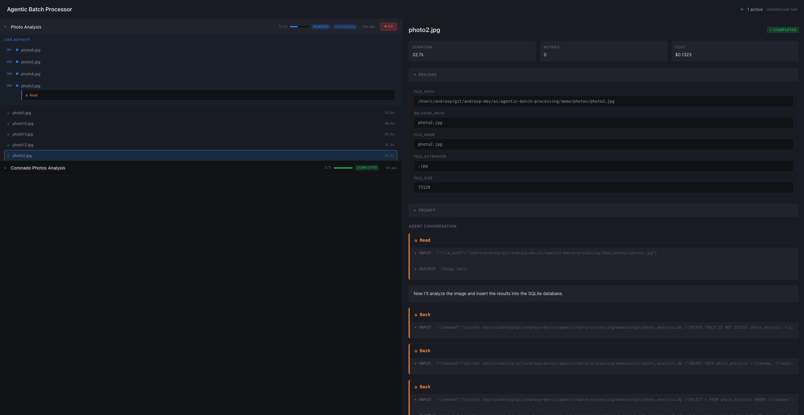

# Agentic Batch Processor


[](https://github.com/andrasp/agentic-batch-processing/actions/workflows/ci.yml)

## The Problem

Ask an LLM to "rename these 500 files to lowercase" and it will write a Python script that handles them all. Ask it to "write docstrings for these 500 functions," a task requiring LLM intelligence for *each* item, and it falls apart. It will do 10-20, then stop. Even with manual "continue" prompts, it eventually loses context, skips items, or halts entirely. There's no built-in mechanism for guaranteed completion when each item needs the LLM to reason, understand, and take action.

## The Solution

Agentic Batch Processor provides a thin orchestration layer that enables reliable, complete processing of arbitrarily large workloads while preserving full agentic autonomy for each item. Agents can work independently, each producing its own output, or they can coordinate through shared resources: writing to a common database, updating a shared document, or building a collective knowledge base as they go. It plugs into Claude as an MCP server or skill, giving Claude the ability to dispatch and track batch work. A real-time dashboard provides visibility into job progress, agent conversations, and results.


*4 workers processing photos in parallel, with live agent conversation showing tool calls*

Each work unit gets its own autonomous agent, not a simple API call, but a full agent that can read files, query databases, call APIs, reason about what to do, and take action. The orchestrator handles dispatch and tracking; each agent handles everything else.

Imagine pointing this at 1,000 academic papers for a literature review. Each agent reads a paper, extracts methodology and findings, and updates a shared literature matrix. As papers are processed, the system builds a citation network, identifies contradictions across studies, and surfaces research gaps. The final output is a structured literature review with synthesis across all sources.

## What Else Can You Do With This?

**Security audit.** Point it at every file in a large codebase. Each agent analyzes a file for vulnerabilities, checks for insecure patterns, and adds findings to a shared security database. As files are processed, the system tracks cross-file dependencies, identifies potential attack chains, and builds a risk heatmap. The final output is a prioritized remediation plan with fix suggestions.

**Competitor analysis.** Point it at competitor websites, docs, and pricing pages. Each agent extracts positioning, features, and pricing, then updates a shared comparison matrix. As competitors are processed, the system identifies feature gaps, pricing opportunities, and positioning conflicts. The final output is a strategic analysis with recommended responses.

**Contract review.** Process a backlog of 500 legal agreements. Each agent reads a contract, extracts parties and obligations, validates against your standard templates, and flags deviations. As contracts are processed, the system builds a risk profile across your portfolio, identifies commonly problematic clauses, and tracks obligation timelines. The final output is a prioritized review queue for attorneys plus a portfolio risk dashboard.

**Knowledge base cleanup.** Analyze every page in your internal wiki. Each agent reads a page, checks for outdated information, identifies redundancies with other pages, and flags contradictions. As pages are processed, the system builds a content graph showing overlaps and gaps, tracks staleness patterns, and identifies consolidation opportunities. The final output is a prioritized cleanup plan with specific merge and archive recommendations.

**Anything where each item needs intelligence.** The pattern applies wherever you have many items that each require understanding, reasoning, and action. Image moderation, customer feedback analysis, compliance checking, translation with cultural adaptation, data quality assessment, and more.

**Try the [Photo Analysis Demo](demo/README.md)** to see it in action: watch photos get analyzed in parallel, with results stored in SQLite and rendered as an HTML gallery.

## How It Works

1. **Describe the task**
   - *"Review all vendor contracts from the past 12 months. Flag non-standard liability clauses and log deviations to contracts_review.db"*

2. **Orchestrator enumerates items**
   - Creates one work unit per contract

3. **Parallel agents spawn**
   - N agents process contracts simultaneously

4. **Each agent works autonomously**
   - Reads the document, reasons about clauses, compares against templates, updates shared findings

5. **Progress tracked persistently**
   - Resume from failures, retry errors, never lose work

6. **Guaranteed completion**
   - Every contract processed, final risk report generated

## What Makes This Different

**Extends Claude, doesn't replace it.** You keep prompting Claude the way you always do. When your task involves processing many items that each need intelligence, the orchestrator handles the scale while Claude handles the thinking. Your workflow doesn't change, it just works on larger problems.

**Agents, not API calls.** Each work unit gets a complete autonomous agent with full tool access. The agent reads files, queries databases, calls APIs, makes decisions, and takes action. It's not a stateless completion, it's Claude doing real work.

**Runs locally, no infrastructure required.** Everything runs on your machine through an MCP server (or host it remotely if you prefer). No distributed systems to build, no cloud services to configure, no external dependencies to manage. Install it, point it at your data, and go.

## When to Use This

Use Agentic Batch Processor when:
- You have many items requiring LLM intelligence (not deterministic transforms)
- Each item needs the agent to *understand* and *take action*, not just return text
- You need guaranteed completion of the entire workload
- Items can be processed independently

**When NOT to use it:** For deterministic operations (rotating images, renaming files, filtering CSVs) where a Python script suffices.

## Key Capabilities

- **Parallel execution:** N agents process items simultaneously
- **Full agent autonomy:** Each agent has complete tool access
- **Real-time dashboard:** Monitor job progress, view agent conversations, inspect results
- **Persistent progress:** Resume from failures, retry errors
- **Conversation capture:** Full agent history stored for debugging
- **Resilient execution:** Detached job manager survives parent termination
- **Generic work units:** Files, URLs, database records, API calls, anything addressable

## Core Concepts

### Jobs and Work Units

**Job.** A batch processing task with a prompt template and a set of work units. Jobs track overall progress and can be resumed or retried if stopped.

**Work Unit.** A single item to be processed (a file, database record, URL, etc.). Each work unit is processed by one agent and tracks its own status, result, and conversation history.

**Prompt Template.** The instruction given to each worker, with placeholders for work unit-specific data. This is automatically generated from your original prompt.

### Enumerators

Enumerators discover and list items to be processed. They convert a high-level specification (a directory path, database query, or custom logic) into concrete work units.

**Concrete Enumerators.** Built-in enumerators for common data sources:
- **File:** Glob patterns for filesystem traversal (`**/*.pdf`, `src/**/*.py`)
- **SQL:** Query results from SQLite databases
- **CSV:** Rows from CSV files
- **JSON:** Items from JSON arrays

**Dynamic Enumerator.** For novel or complex data sources, the LLM can generate Python code that enumerates items. The code has full Python capabilities (network access, database connections, cloud SDKs like boto3, etc.). **Security model**: LLM-generated code requires explicit user approval before execution. The system presents the code for review; only after confirmation does it run.

The LLM describes *how* to enumerate (parameters or code), but enumeration itself happens server-side. This keeps item lists out of the conversation, enabling processing of arbitrarily large datasets without token overhead.

### Execution

**Worker.** An autonomous agent instance that processes a work unit. Workers have full tool access and execute independently. Multiple workers run in parallel.

**Worker Pool.** Manages parallel execution of workers. Configurable concurrency (e.g., 8 workers processing simultaneously). Handles worker lifecycle and resource management.

**Orchestrator.** The coordination layer that manages jobs, dispatches work units to workers, tracks progress, and handles failures. Runs as an MCP server.

### Persistence and Recovery

**Job Repository.** SQLite database storing all job state, work unit status, and results. Enables resume after crashes and historical analysis.

**Conversation Capture.** Full agent conversation history stored per work unit. Essential for debugging, auditing, and understanding agent decisions.

**Failure Recovery.** Failed work units are tracked and can be retried. Jobs can resume from where they left off after interruption.

### Visibility

**Dashboard.** Web-based UI for monitoring jobs in real-time. View progress, inspect individual work units, read agent conversations, and analyze results.

**Job Status.** Jobs progress through states: created → testing → running → post_processing → completed/failed. Track completion percentage, success/failure counts, and estimated time remaining.

**Work Unit Status.** Each unit tracks its state: pending → processing → completed/failed. Failed units include error details and can be retried.

## Getting Started

**Prerequisites:**
- [uv](https://docs.astral.sh/uv/) installed
- [Claude Code](https://claude.ai/claude-code) CLI installed and available on PATH

Add to your MCP client configuration (Claude Desktop, Claude Code, etc.):

```json
{
  "mcpServers": {
    "agentic-batch": {
      "command": "uvx",
      "args": ["--from", "git+https://github.com/andrasp/agentic-batch-processing", "abp-mcp"]
    }
  }
}
```

That's it. Once connected, describe your batch task naturally. The orchestrator handles enumeration, parallel dispatch, and progress tracking.

See [Configuration](#configuration) for optional environment variables to customize workers, retries, storage, and dashboard port.

## Documentation

- [Usage Guide](docs/usage-guide.md): When to use this vs. generating scripts. Decision tree and cost considerations.
- [Processing Patterns](docs/patterns.md): Map, scatter-gather, and scatter-gather-synthesize patterns.
- [Architecture](docs/architecture.md): System design and component overview.
- [Troubleshooting](docs/troubleshooting.md): Common issues and solutions.

**Component Reference**
- [MCP Server](docs/components/mcp-server.md): Tool definitions and API.
- [Enumerators](docs/components/enumerators.md): File, SQL, CSV, JSON, and dynamic enumerators.
- [Dashboard](docs/components/dashboard.md): Web UI for monitoring jobs.
- [Job Manager](docs/components/job-manager.md): Detached process lifecycle.
- [Worker Pool](docs/components/worker-pool.md): Parallel execution management.
- [Persistence](docs/components/persistence.md): SQLite repository and schema.

## Configuration

All settings are optional. Configure via environment variables in your MCP config:

| Variable | Default | Description |
|----------|---------|-------------|
| `ABP_MAX_WORKERS` | `4` | Maximum parallel worker agents |
| `ABP_MAX_RETRIES` | `3` | Retry attempts for failed work units |
| `ABP_STORAGE_PATH` | `~/.agentic-batch/batch.db` | SQLite database location |
| `ABP_DASHBOARD_PORT` | `3847` | Dashboard web server port |
| `ABP_SKIP_TEST` | `false` | Skip test phase when starting jobs |

Example with custom settings:
```json
{
  "mcpServers": {
    "agentic-batch": {
      "command": "uvx",
      "args": ["--from", "git+https://github.com/andrasp/agentic-batch-processing", "abp-mcp"],
      "env": {
        "ABP_MAX_WORKERS": "8",
        "ABP_STORAGE_PATH": "/custom/path/batch.db"
      }
    }
  }
}
```

## License

MIT
