# Photo Analysis Demo

This demo shows the [scatter-gather-synthesize pattern](../docs/patterns.md): analyze photos in parallel, store structured results in SQLite, and generate an HTML gallery with summary statistics.

In practice, you'd use Agentic Batch Processor for hundreds or thousands of images. This demo uses 12 to keep runtime short and costs low while demonstrating the full workflow.

## Prerequisites

- [Claude Code CLI](https://docs.anthropic.com/en/docs/claude-code) installed and available on PATH
- Agentic Batch Processor configured as an MCP server (see [main README](../README.md#getting-started))

## Running the Demo

1. Open your MCP client (Claude Desktop, Claude Code, etc.)

2. Copy the contents of [`prompt.txt`](prompt.txt) and replace `<repo>` with your actual repository path:

   ```
   Analyze each image in /path/to/agentic-batch-processing/demo/photos and extract what you see.
   ...
   ```

3. Submit the prompt. The orchestrator will:
   - Enumerate all 12 images in `demo/photos/`
   - Process images in parallel (4 workers by default)
   - Each agent analyzes its image and writes to the shared SQLite database
   - After all images are processed, generate the HTML report

## Expected Output

After completion, `demo/output/` will contain:

- `photo_analysis.db` - SQLite database with extracted attributes for each photo
- `report.html` - Single-page HTML report showing each photo with its data and summary statistics

## Monitoring Progress

Open the dashboard (default: http://localhost:3847) to watch job progress, view individual agent conversations, and inspect results in real-time.

## Walkthrough

Here's what a complete demo run looks like:

### 1. Submit the Prompt

Claude receives the prompt, creates a batch job, and runs a test on the first photo to validate the workflow before committing to the full run.

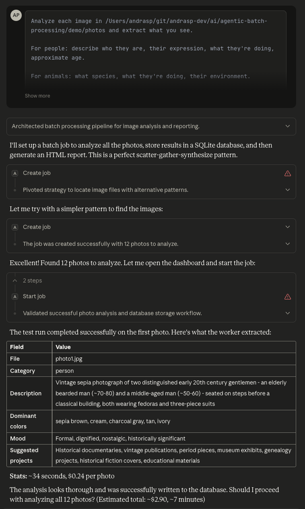

*Claude creates the job, tests on photo1.jpg, shows extracted data and cost estimate (~$0.24/photo), asks for confirmation*

### 2. Test Phase

The dashboard shows the job in TESTING state while validating the workflow.

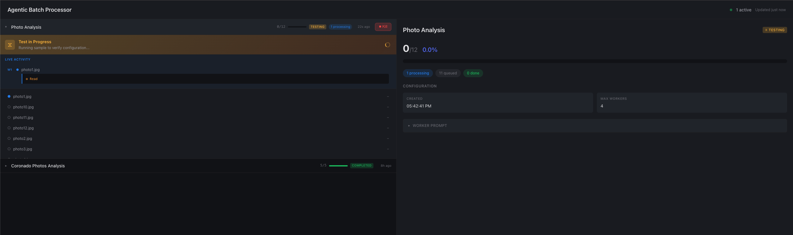
*Dashboard showing test in progress — verifying configuration before processing all 12 photos*

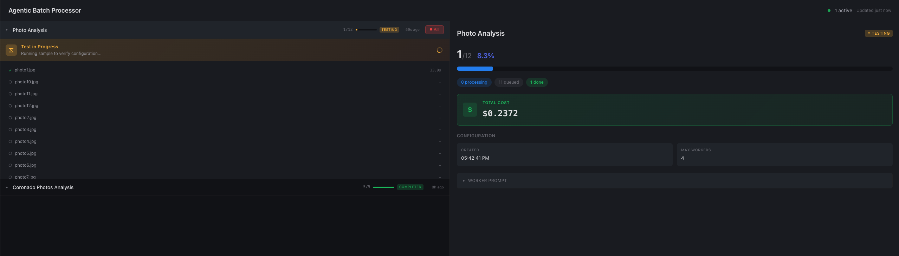
*Test complete with cost estimate visible ($0.24 for first photo)*

### 3. Parallel Processing

Once confirmed, 4 workers process photos simultaneously. Each worker is a full autonomous agent with tool access.


*4 workers active (W1-W4), processing different photos. Right panel shows agent conversation — Read tool to view image, Bash commands to write to SQLite*

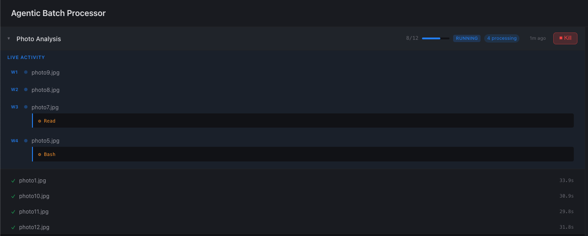
*8/12 complete. 4 workers processing photos in parallel, each taking 26-33s*

### 4. Post-Processing (Synthesis)

After all 12 photos are analyzed, the post-processing phase generates the HTML report from the gathered data.

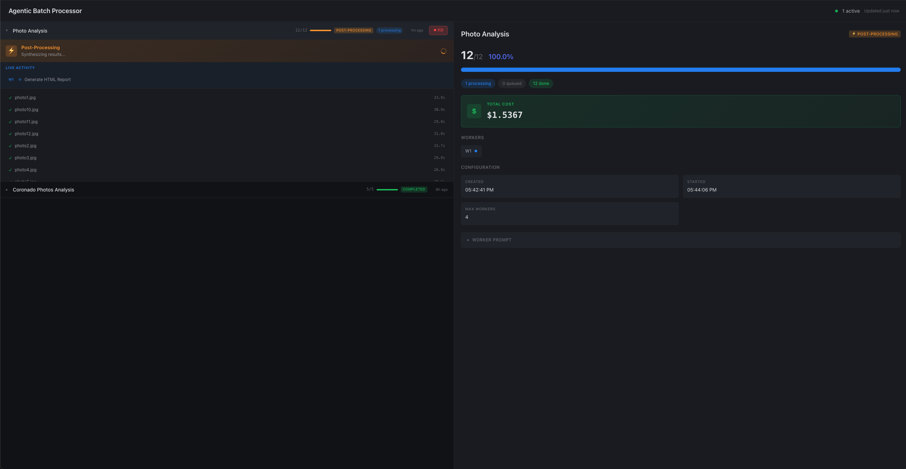
*12/12 photos done (100%). Post-processing phase begins — "Generate HTML Report" task running*

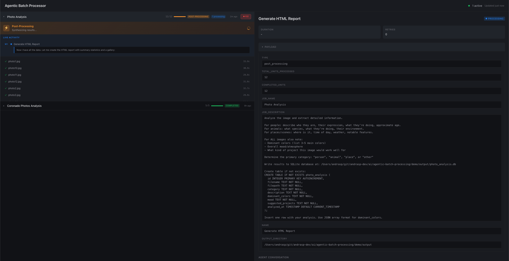
*Post-processing agent receives auto-generated worker prompt (Claude converts your natural language request into structured instructions with SQL schema)*

### 5. Synthesis Agent Conversation

The post-processing agent queries the database and generates the report.

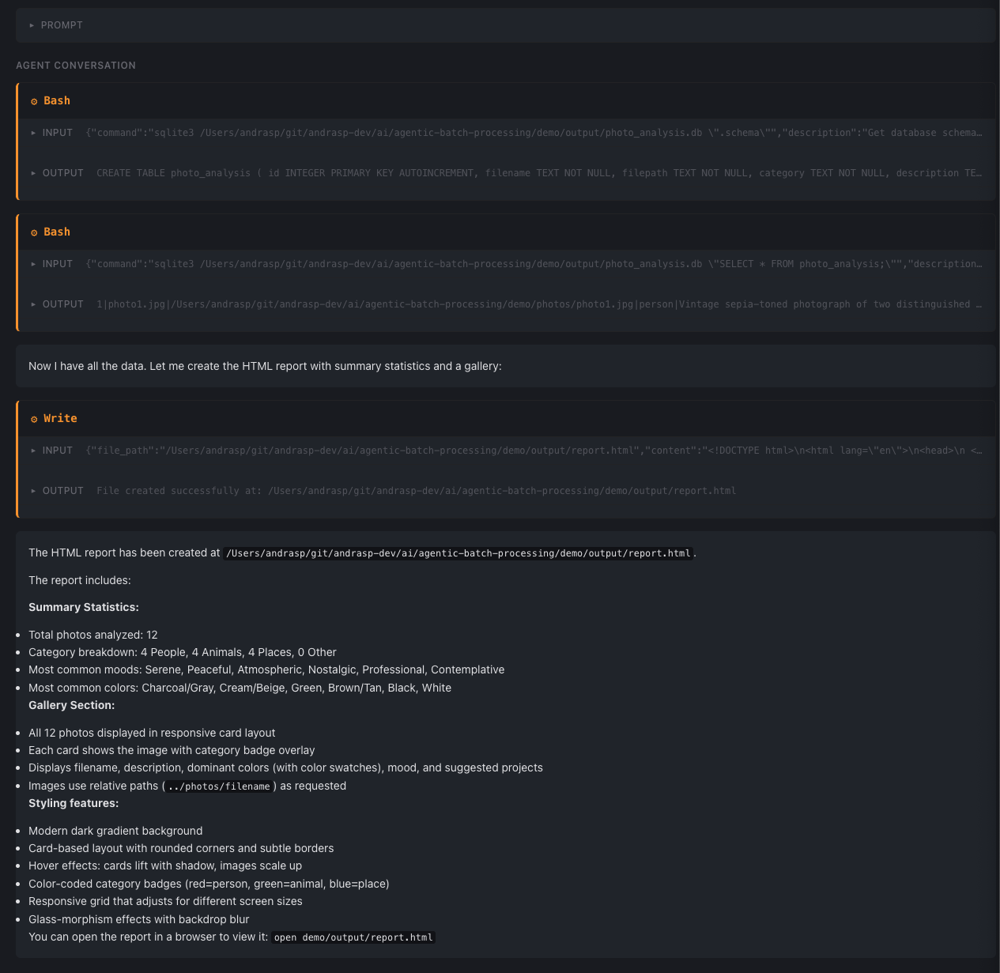
*Agent queries SQLite for schema and data, then writes report.html. Summary shows category breakdown, common moods/colors, and styling features*

### 6. Progress in Claude Desktop

Claude monitors the job and reports progress.

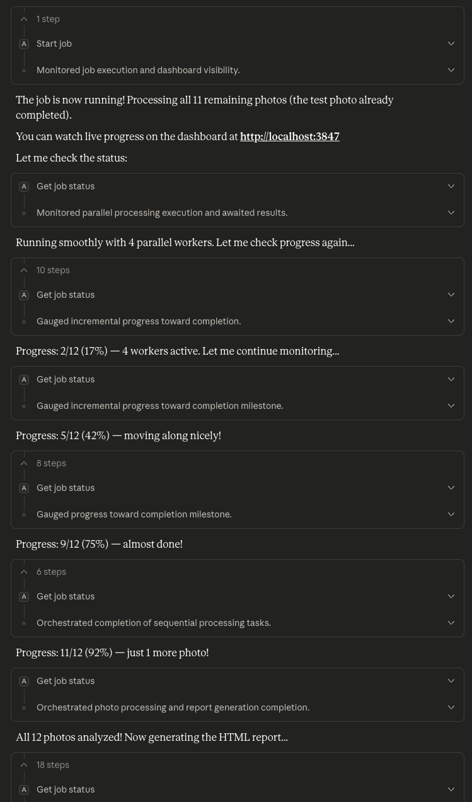

*Claude Desktop showing progress: "2/12 (17%)... 5/12 (42%)... 9/12 (75%)... almost done!"*

### 7. Job Complete

The dashboard shows the completed job with final statistics.

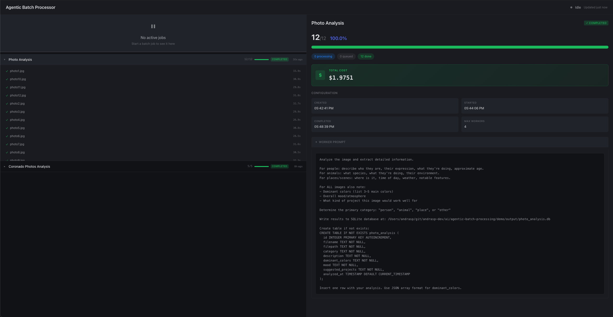
*Job COMPLETED. Total cost $1.97, all 12 photos processed with individual timing*

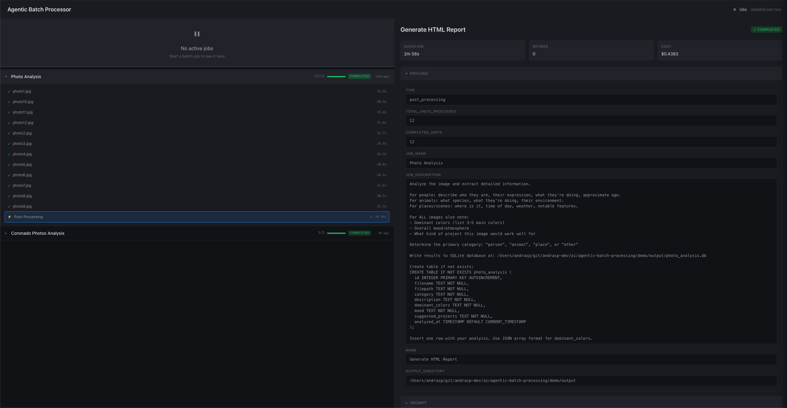
*Completed job showing post-processing unit details — 2m 58s, $0.44 for report generation*

### 8. Results

The structured data is stored in SQLite and rendered in the HTML report.

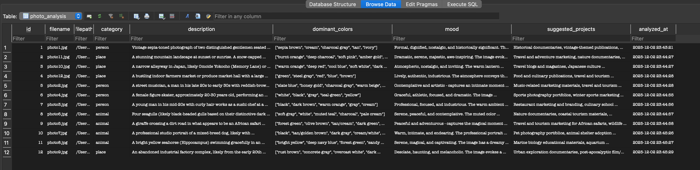

*SQLite browser showing extracted data: descriptions, dominant colors, moods, suggested projects for all 12 photos*

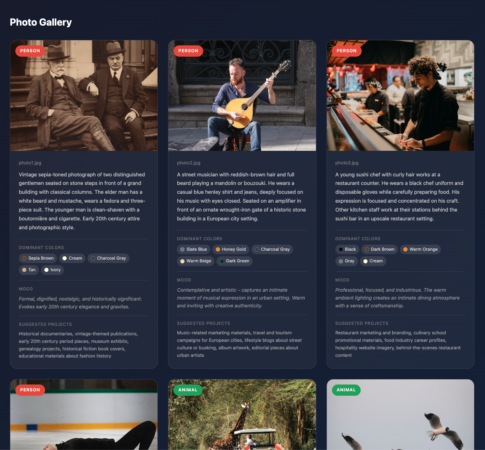

*Sample output showing summary statistics and photo gallery. [View full HTML](sample_report.html) (clone repo and open locally).*

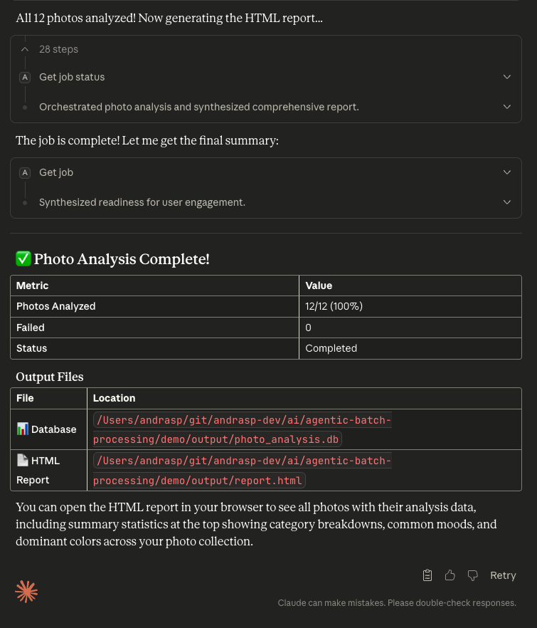

*Claude Desktop final summary with output file locations (database + HTML report)*

## Photo Licenses

All photos in `demo/photos/` are sourced from [Unsplash](https://unsplash.com) under the [Unsplash License](https://unsplash.com/license), which permits free use for commercial and personal projects without attribution (though attribution is appreciated).
