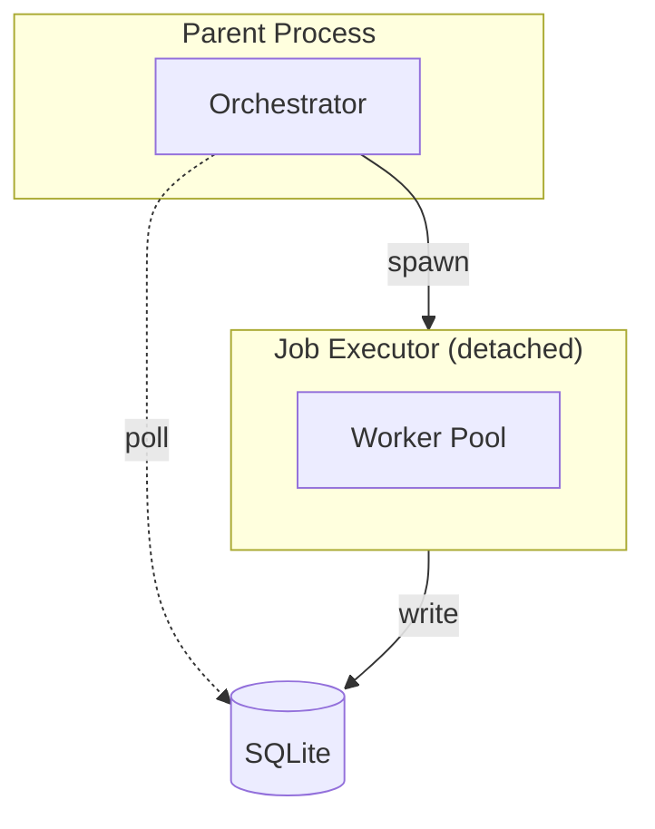
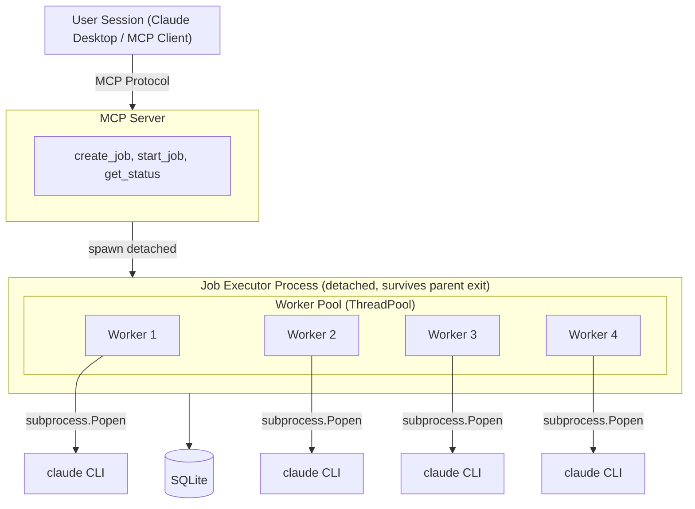

# Agentic Batch Processor - Architecture

## Overview

The Agentic Batch Processor is a system for running parallel LLM-powered tasks across many work units (files, database records, URLs, etc.). It spawns multiple Claude CLI processes as workers and orchestrates their execution.

## Core Components

### 1. [Orchestrator](components/orchestrator.md) (`core/orchestrator.py`)
The main entry point for creating and managing jobs. Responsibilities:
- Create jobs from user intent and enumerator configuration
- Synthesize worker prompts from user intent
- Coordinate test execution before full batch processing
- Track job progress and completion

### 2. [Job Executor](components/job-manager.md) (`core/job_executor.py`)
Runs as a **detached background process** that survives parent termination. Key features:
- Spawned via `multiprocessing.Process` with `daemon=False`
- Manages the worker pool lifecycle
- Handles graceful shutdown on SIGTERM/SIGINT
- Logs all activity to SQLite for monitoring
- Can be resumed after restart

### 3. [Worker Pool](components/worker-pool.md) (`core/worker_pool.py`)
Manages concurrent worker execution using `ThreadPoolExecutor`. Features:
- Configurable max workers (parallel execution limit)
- Real-time conversation streaming via callbacks
- Automatic retry on failure (configurable max retries)
- Worker status tracking in database

### 4. [Claude CLI Worker](components/workers.md) (`workers/claude_cli_worker.py`)
Spawns Claude CLI processes to execute individual work units. Two variants:
- `ClaudeCliWorker`: Base worker for generic tasks
- `ClaudeCliWorkerWithFiles`: Adds `--add-dir` for file access

### 5. [Enumerators](components/enumerators.md) (`enumerators/`)
Pluggable data source adapters that enumerate work units:
- `FileEnumerator`: Glob patterns over filesystem
- `SQLEnumerator`: SQL query results
- `CSVEnumerator`: CSV file rows
- `JSONEnumerator`: JSON array items
- `DynamicEnumerator`: Custom Python function

### 6. [Repository](components/persistence.md) (`persistence/repository.py`)
SQLite-based persistence layer for:
- Jobs and work units
- Worker status
- Conversation history (streamed in real-time)
- Execution logs

### 7. [Dashboard](components/dashboard.md) (`dashboard/`)
Web-based monitoring UI:
- Real-time job progress
- Worker status and activity
- Conversation viewer with markdown rendering
- Log viewer with filtering

### 8. [MCP Server](components/mcp-server.md) (`mcp_server.py`)
Model Context Protocol server exposing tools for:
- Creating and starting jobs
- Monitoring progress
- Viewing results

## Data Flow

1. **Job Creation**: User intent → Prompt Synthesizer → Worker prompt template
2. **Enumeration**: Data source → Enumerator → Work units in database
3. **Execution**: Work unit → Worker pool → Claude CLI → Results
4. **Monitoring**: Database → Dashboard API → Web UI

## Process Architecture

## Key Design Decisions

### Detached Job Executor
The job executor runs as a non-daemon process so it can:
- Continue processing if the MCP client disconnects
- Be monitored via the dashboard independently
- Resume processing after system restart

### Real-time Conversation Streaming
Worker conversations are streamed to the database as they happen:
- Uses `--output-format stream-json` with Claude CLI
- Callbacks append conversation events in real-time
- Dashboard displays live progress during processing

### SQLite for Persistence
Single-file database provides:
- No external dependencies
- Atomic operations
- Easy backup and inspection
- Sufficient for typical batch sizes

## Configuration

Default paths:
- Database: `~/.agentic-batch/batch.db`
- Dashboard PID: `~/.agentic-batch/dashboard.pid`
- Logs: Written to database `logs` table

Worker configuration:
- `max_workers`: Parallel execution limit (default: 4)
- `max_retries`: Per-unit retry count (default: 3)
- `timeout`: Per-unit timeout in seconds (default: 600)
