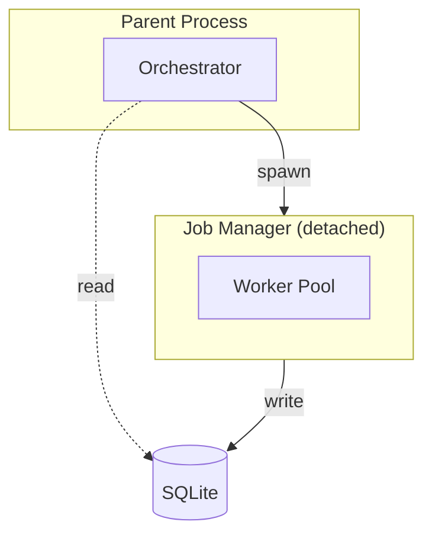

# Job Manager

The Job Manager enables resilient job execution by running as a detached background process. It survives parent process termination and can be resumed after interruptions, ensuring jobs complete even when the initiating process ends.

## Problem Solved

When batch processing is initiated from an [MCP server](mcp-server.md) or CLI, the parent process might terminate for various reasons:

- User closes Claude Desktop
- Network timeout on MCP connection
- System sleep or shutdown
- Application crash

Without the Job Manager, work would stop and state would be lost. The Job Manager solves this by:

1. Spawning as a separate process (not a daemon)
2. Persisting all state to SQLite
3. Supporting graceful shutdown and resume

## Architecture

The Job Manager uses a parent-child process model:

The parent spawns the manager and can exit immediately. The manager continues running, writing all progress to the [SQLite database](persistence.md). Any process can read the database for status.

## Process Lifecycle

### Starting

`start_detached()` creates a non-daemon child process:

1. Creates a `multiprocessing.Process` with `daemon=False`
2. Starts the process
3. Stores the PID in job metadata
4. Returns the PID to the caller

The parent can exit after this — the child continues independently.

### Main Loop

The `_run_job_loop()` method runs in the child process:

1. Re-initializes the repository (child process needs its own connection)
2. Sets up signal handlers for graceful shutdown
3. Updates job status to RUNNING
4. Creates and starts a worker pool
5. Enters processing loop:
   - Fetches pending work units
   - Submits to worker pool
   - Checks for stop signal
   - Waits for available slots
6. Waits for all workers to complete
7. Updates final job status

### Signal Handling

The manager handles two signals:

- **SIGTERM**: Graceful shutdown request
- **SIGINT**: Interrupt (Ctrl+C)

Both set a `_should_stop` flag that the main loop checks regularly. When set, the manager:

1. Stops accepting new work units
2. Waits for active workers to complete
3. Saves final state
4. Exits cleanly

### Final Status

After processing, the job status is set based on results:

- **COMPLETED**: All units completed successfully
- **FAILED**: Some units failed after max retries
- **PAUSED**: Stopped before all units processed (can resume)

## Status Monitoring

`get_manager_status()` returns current state:

- **not_found**: Job doesn't exist
- **not_started**: No manager PID in metadata
- **running**: Process is alive
- **stopped**: Process exited

The method checks if the process is running using `os.kill(pid, 0)`, which tests existence without sending a signal.

Status includes:
- PID
- Job status
- Start/completion times
- Error message (if failed)
- Progress (total, completed, failed, percentage)

## Stopping

`stop_manager()` sends SIGTERM to the manager process. The manager catches this and shuts down gracefully:

1. Stops submitting new units
2. Waits for active workers to finish
3. Updates job status to PAUSED
4. Exits

## Resuming

`resume_job()` handles restarting after interruption:

1. Checks if the job exists
2. Verifies there are pending units
3. Checks if a manager is already running (returns existing PID if so)
4. Creates a new manager and starts it

Resume is safe to call multiple times — it won't spawn duplicate managers.

## Database as Communication Channel

All communication between the parent and manager happens through SQLite:

- Parent reads job status and progress
- Manager writes unit completions and failures
- Dashboard reads for visualization
- Resume reads to find pending units

This decoupling means:
- Parent doesn't need to stay connected
- Multiple processes can monitor
- Crash recovery is automatic (just query the database)

## Error Handling

Unhandled exceptions in the manager:

1. Are caught at the top level
2. Set job status to FAILED
3. Store error message in job metadata
4. Exit cleanly

This ensures failures are visible and the job can potentially be resumed after fixing the issue.

## Callbacks

The manager provides callbacks to the worker pool:

- **on_unit_complete**: Updates job's completed_units count
- **on_unit_failed**: Either requeues for retry or increments failed_units

These run in worker threads but only perform quick database updates.

## Use Cases

The Job Manager is essential for:

1. **Long-running batch jobs**: Processing thousands of items takes hours
2. **MCP server execution**: Parent may disconnect
3. **Scheduled/automated jobs**: No user waiting
4. **Crash recovery**: Resume after system restart
5. **Distributed monitoring**: Multiple dashboards tracking progress
