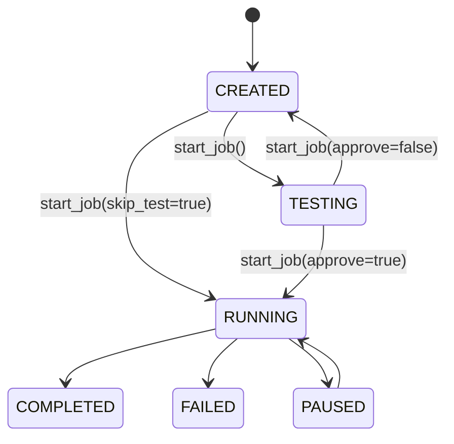

# Orchestrator

The Orchestrator is the central coordination layer of the Agentic Batch Processor. It manages the entire lifecycle of batch jobs, from creation through completion, coordinating between [enumerators](enumerators.md), the [worker pool](worker-pool.md), and the [persistence layer](persistence.md).

## Responsibilities

The Orchestrator handles five core responsibilities:

1. **Job Creation** — Accepts user intent and enumerator configuration, creates the job record and all work units
2. **Work Unit Generation** — Transforms enumerated items into work units with appropriate payloads
3. **Test Execution** — Runs a single work unit for user approval before committing to full batch
4. **Worker Pool Management** — Creates and manages the worker pool during job execution
5. **Progress Tracking** — Monitors completion, handles callbacks, and updates job status

## Job Creation Flow

When creating a job, the Orchestrator follows this sequence:

1. Instantiates the appropriate enumerator based on type (file, sql, csv, json, dynamic)
2. Validates the enumerator configuration
3. Calls `enumerate()` to discover all items
4. Generates a worker prompt using the PromptSynthesizer
5. Creates the Job record in the repository
6. Creates a WorkUnit for each enumerated item
7. Returns job metadata including the generated prompt

The Orchestrator delegates all enumeration logic to the enumerator subsystem. This separation allows adding new data sources without modifying orchestration logic.

## Test Execution

Before processing an entire batch, users can run a test on the first work unit. The test flow:

1. Selects the first pending work unit from the job
2. Executes the worker against this unit synchronously
3. Records the test result (output, conversation, cost) on the unit
4. Updates job status to TESTING
5. Returns the full result including conversation for user review

Users review the test output and either approve (proceed with remaining units) or reject (reset to CREATED to modify the prompt). The test phase can be skipped via `skip_test=true` or the `ABP_SKIP_TEST=1` environment variable.

## Job Execution

Once a job is created, the actual execution is handled by the **JobExecutor** (not the Orchestrator). The Orchestrator's role ends after job creation — it creates jobs and provides status queries, while the JobExecutor handles parallel execution in a detached background process.

See [Job Manager](job-manager.md) for execution details.

## Dependencies

The Orchestrator requires three dependencies at construction:

- **Repository** — For persisting jobs and work units
- **Worker Implementation** — The actual worker class (e.g., ClaudeCliWorker)
- **PromptSynthesizer** — Optional, defaults to standard synthesizer

This dependency injection allows swapping worker implementations or using custom prompt generation.

## Status Transitions

Jobs move through these states:

- **CREATED**: Job and work units exist but haven't been started
- **TESTING**: Test execution completed, awaiting user approval
- **RUNNING**: Actively processing work units
- **PAUSED**: Temporarily stopped (can resume)
- **COMPLETED**: All units processed successfully
- **FAILED**: Some units failed after max retries

## Integration Points

The Orchestrator integrates with:

- **[Enumerators](enumerators.md)** — Discovers items to process
- **[PromptSynthesizer](prompt-synthesizer.md)** — Generates per-item prompts
- **[Repository](persistence.md)** — Persists all state
- **[WorkerPool](worker-pool.md)** — Executes work units in parallel
- **[MCP Server](mcp-server.md)** — Exposes orchestrator methods as MCP tools
