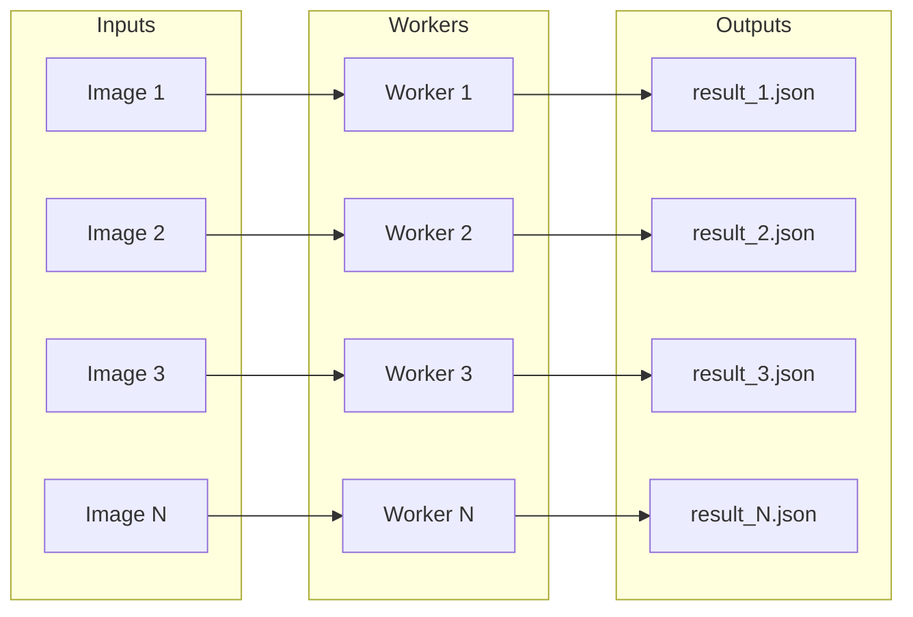
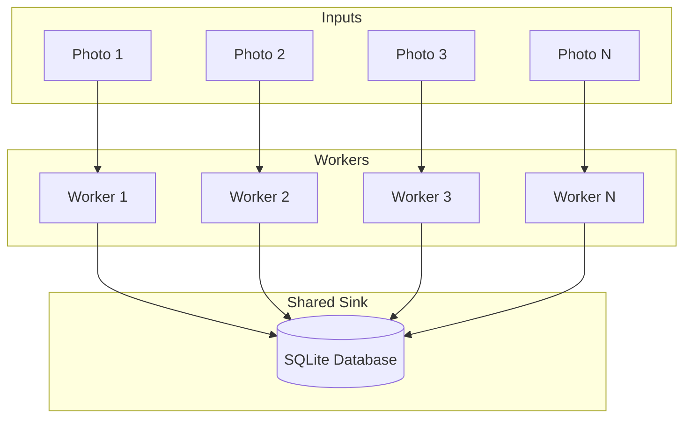
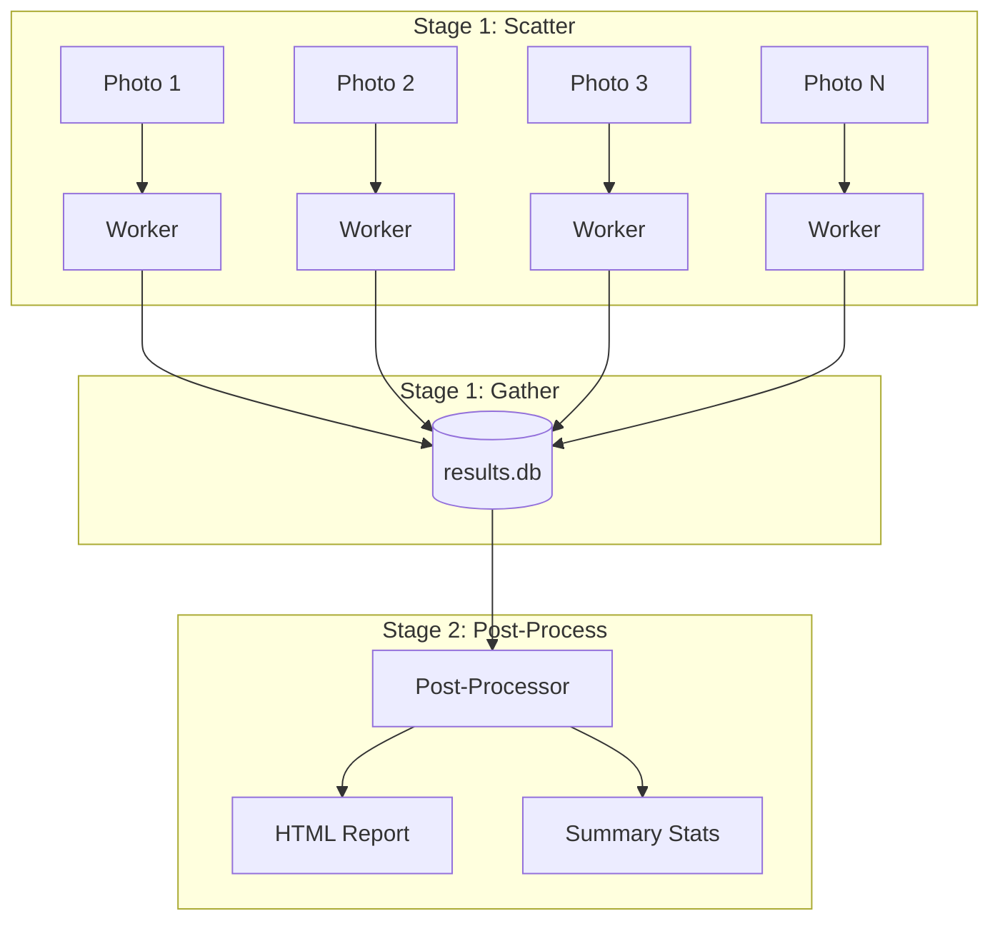
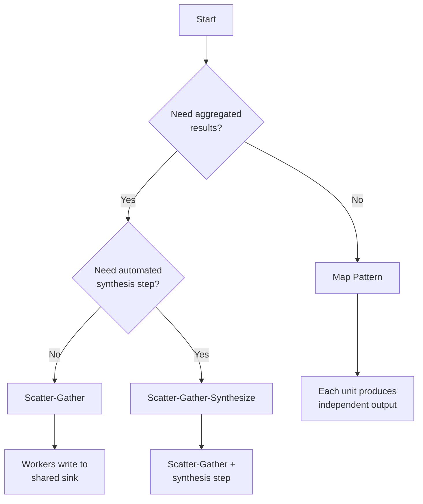

# Processing Patterns

This guide covers the core patterns for structuring batch processing jobs, from simple independent outputs to complex aggregation workflows.

## Overview

Agentic Batch Processor supports three primary patterns:

| Pattern | Output Model | Use Case |
|---------|--------------|----------|
| **Map** | 1 input → 1 output | Independent transformations |
| **Scatter-Gather** | N inputs → shared sink | Aggregated results in queryable format |
| **Scatter-Gather-Synthesize** | Scatter-Gather + synthesis | Aggregation followed by synthesis (reports, visualizations, exports, etc.) |

## Map Pattern

The simplest pattern: each work unit produces its own independent output.



### When to Use

- Each item's analysis is self-contained
- Results don't need to reference each other
- You want simple, predictable output structure
- Post-processing will combine results separately

### Example: Image Analysis

*"For each image, generate a JSON file with detected objects, colors, and composition notes."*

Each worker:
1. Reads one image
2. Analyzes content
3. Writes `{image_name}_analysis.json`

No coordination needed. Workers never interact.

### Output Strategies

**File per unit** — Each work unit produces one or more files in an output directory. File naming typically derives from the input (e.g., `photo.jpg` → `photo_analysis.json`).

**Structured directory** — Workers write to subdirectories organized by category, date, or other attributes discovered during processing.

---

## Scatter-Gather Pattern

Multiple workers write to shared sink(s), building aggregated results as processing proceeds.



### When to Use

- Results need to be queryable together
- You're building a unified dataset
- Cross-referencing between items is valuable
- Final output is an aggregation, not individual files

### Example: Photo Cataloging

*"Analyze each photo. Record descriptions, detected people, locations, and timestamps in a SQLite database."*

Each worker:
1. Reads one photo
2. Extracts metadata and analyzes content
3. Inserts row(s) into shared database

The database grows as workers complete, becoming immediately queryable.

### Concurrent Sink Types

Not all sinks handle concurrent writes safely. Choose based on your requirements:

#### SQLite (Recommended)

SQLite with WAL (Write-Ahead Logging) mode handles concurrent writes from multiple processes gracefully. Writers queue automatically; readers never block.

**Characteristics:**
- Automatic write serialization
- No data loss under concurrent access
- Single file, portable
- Transactions ensure consistency

**Best for:** Most scatter-gather workloads. The slight write serialization overhead is negligible compared to LLM processing time.

**Considerations:** Very high write volumes (thousands per second) may see contention. For typical agentic workloads where each write follows seconds of LLM processing, this is not a concern.

#### Append-Only Files (CSV, JSONL)

Files where workers only append lines can handle concurrent writes, but require care.

**Characteristics:**
- Simple format, easy to process
- Append operations are generally atomic for small writes
- No built-in transaction support
- Interleaved writes possible without file locking

**Best for:** Simple logging, event streams, or when you'll post-process the file anyway.

**Considerations:** Use file locking or write to separate files and concatenate later if write atomicity matters.

#### External Databases (PostgreSQL, MySQL)

Full database servers handle concurrent writes natively with proper transaction isolation.

**Characteristics:**
- Designed for concurrent access
- Full ACID transactions
- Network overhead
- Requires running server

**Best for:** Large-scale deployments, existing database infrastructure, or when you need advanced query capabilities.

#### Sinks to Avoid for Concurrent Writes

- **Regular JSON files** — Concurrent modifications corrupt structure
- **XML files** — Same issue as JSON
- **Shared spreadsheets** — Lock contention and merge conflicts

### Conflict Handling

When multiple workers might update the same logical record:

**Last-write-wins** — Acceptable when workers process distinct items and updates don't overlap.

**Insert-only** — Workers only insert; deduplication happens in post-processing or queries.

**Upsert with merge** — Database handles conflicts (e.g., `INSERT ... ON CONFLICT UPDATE`). Best when workers might reprocess items.

---

## Scatter-Gather-Synthesize Pattern

The Scatter-Gather-Synthesize pattern is **Scatter-Gather with a synthesis step**. Workers write to a shared sink (like Scatter-Gather), and after all items complete, a post-processing agent reads from that sink to generate final outputs.



### When to Use

Use Scatter-Gather-Synthesize when you need Scatter-Gather **plus** a final synthesis step:

- Final deliverable requires synthesis across all items (reports, summaries)
- Visualization or formatting depends on complete data
- You want automated generation of derived artifacts after collection
- Quality checks need the full picture before producing output

If you only need aggregated data without automated synthesis, use Scatter-Gather instead.

### Example: Photo Collection Report

The [Photo Analysis Demo](../demo/) implements this exact pattern.

*"Analyze each photo in the collection. Write results to a database. Then generate an HTML report showing all photos with their analysis, statistics, and a photo gallery."*

**Stage 1 (Parallel):** Workers analyze photos, write to SQLite

**Stage 2 (Post-processing):** Single agent reads complete database, generates:
- HTML gallery with embedded analysis
- Statistics (total photos, people detected, location breakdown)
- Timeline visualization

### Creating a Scatter-Gather-Synthesize Job

Use the `post_processing_prompt` parameter when creating a job:

```python
# Via MCP tool
create_job(
    name="Analyze Photo Collection",
    user_intent="Analyze this photo and write the results to /output/results.db",
    enumerator_type="file",
    enumerator_config={
        "base_directory": "/photos",
        "pattern": "*.jpg"
    },
    post_processing_prompt="""
    Read all analysis results from /output/results.db.
    Generate an HTML report at /output/gallery.html that includes:
    - A photo gallery with thumbnails
    - Statistics on detected objects and people
    - A timeline of when photos were taken
    """
)
```

The `post_processing_prompt` is entirely optional. If omitted, the job behaves as a standard Map or Scatter-Gather pattern (depending on your output configuration).

### Post-Processing Steps

Post-processing runs after all work units complete successfully. The post-processor agent receives context including:

- Job metadata (name, description, total units processed)
- Summary statistics (completed count, any failures)

Each work unit (including post-processing) can specify its own `working_directory` and `output_directory` in its payload. The worker will set the cwd and add the output directory to `--add-dir` for write access.

Post-processing is itself an agentic task—the agent can read the aggregated data, reason about it, and produce derived outputs using the same tools available to regular workers.

**Common post-processing tasks:**
- Generate reports (HTML, PDF, Markdown)
- Create visualizations
- Compute aggregate statistics
- Build indexes or search structures
- Validate cross-item consistency
- Export to different formats

### Dashboard Visualization

During post-processing, the [dashboard](components/dashboard.md) displays a distinct visual treatment:

- The job status shows as **"post_processing"** with a teal accent color
- A prominent **Post-Processing banner** appears at the top of the job card
- The banner shows real-time status: "Synthesizing results...", "Synthesis complete", or "Synthesis failed"
- Clicking the banner opens the post-processing unit's conversation in the inspector panel
- In the Previous Jobs list, post-processing units appear with a distinctive teal accent

This visual separation makes it clear that the job has transitioned from parallel work to the synthesis phase.

### Completion Requirements

Post-processing triggers when:
- All work units have completed successfully
- Job transitions to `POST_PROCESSING` status

If any work units fail, post-processing is **not triggered**. The job will transition to `FAILED` status instead. This ensures the post-processor always works with complete data.

To handle partial results, you have options:
- Fix or retry failed units, then resume the job
- Create a new job excluding the problematic items
- Use a Scatter-Gather pattern instead, querying only successful results

---

## Choosing a Pattern



### Decision Factors

| Factor | Map | Scatter-Gather | Scatter-Gather-Synthesize |
|--------|-----|----------------|---------------------------|
| Output independence | High | Low | Low |
| Shared sink | No | Yes | Yes |
| Automated synthesis | No | No | Yes |
| Final deliverable | Collection of files | Queryable database | Synthesized output from aggregated data |
| Complexity | Simple | Moderate | Scatter-Gather + synthesis |

---

## Pattern Combinations

Real workloads often combine patterns:

**Map + External Aggregation:** Workers produce individual files; a separate script or tool combines them.

**Scatter-Gather + Multiple Sinks:** Workers write to both a database (for querying) and individual files (for archival).

**Chained Jobs:** Post-processing output becomes input for another batch job.

The framework is flexible—choose the pattern that matches your output requirements, and compose them as needed.
